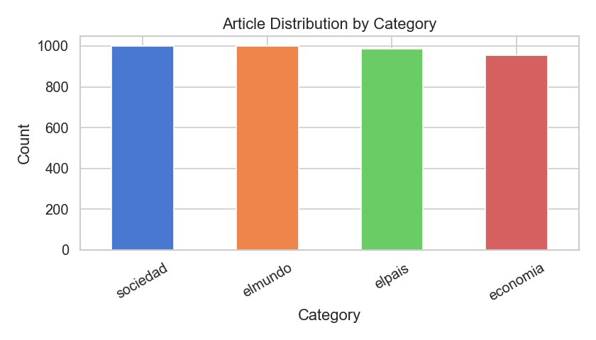
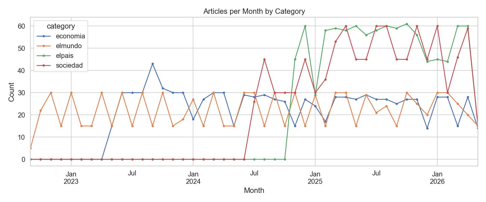
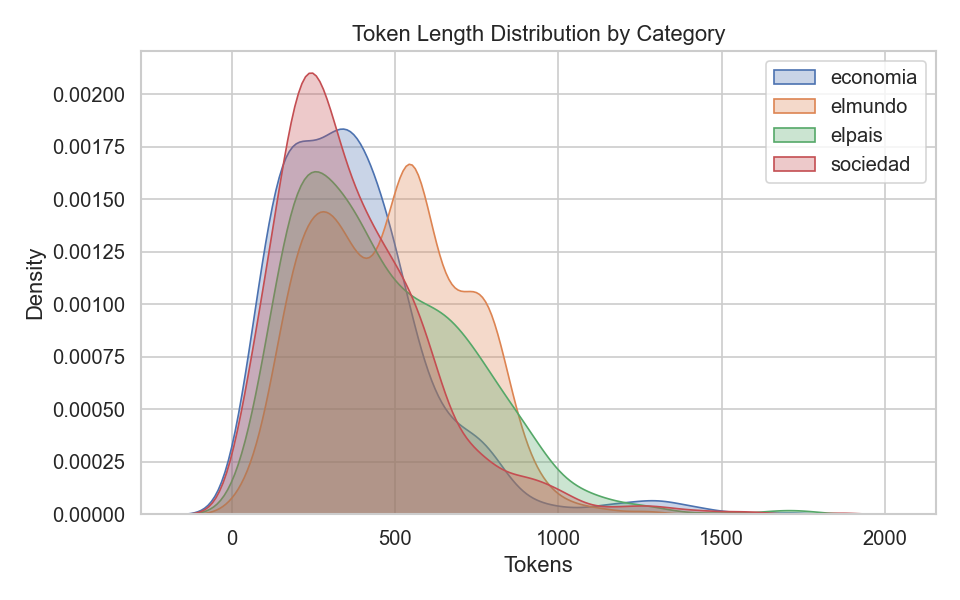
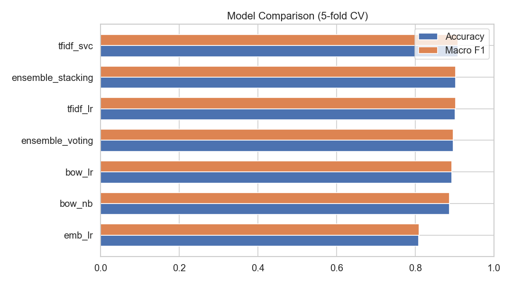
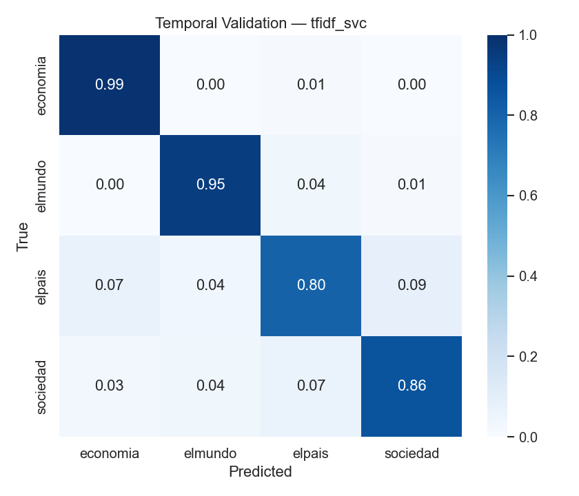

# Web Mining TP1 — Clasificación de Noticias Página 12

Trabajo Práctico 1 de Web Mining. Pipeline completo de scraping, procesamiento NLP y clasificación automática de noticias del diario [Página 12](https://www.pagina12.com.ar) en cuatro categorías: **Economía**, **El País**, **Sociedad** y **El Mundo**.

---

## Resultados

### Cross-Validation 5-fold estratificado (3.941 artículos)

| Modelo | Accuracy | Macro F1 |
|--------|:--------:|:--------:|
| **TF-IDF + LinearSVC** | **0.908 ± 0.011** | **0.908 ± 0.011** |
| Stacking (LR meta-learner) | 0.902 ± 0.007 | 0.902 ± 0.007 |
| TF-IDF + Logistic Regression | 0.901 ± 0.010 | 0.902 ± 0.010 |
| Soft Voting (TF-IDF+LR ∪ BoW+LR) | 0.896 ± 0.011 | 0.896 ± 0.011 |
| BoW + Logistic Regression | 0.892 ± 0.010 | 0.893 ± 0.011 |
| BoW + Naive Bayes | 0.887 ± 0.011 | 0.887 ± 0.011 |
| Sentence Embeddings + LR | 0.808 ± 0.011 | 0.809 ± 0.011 |

### Validación Temporal (mejor modelo: TF-IDF + LinearSVC)

| Conjunto | Período | Artículos |
|----------|---------|----------:|
| Train | sept 2022 → feb 2026 | 3.481 |
| Test | feb 2026 → may 2026 | 460 |

**Accuracy: 0.874 — Macro F1: 0.878** (caída de solo −3% respecto a CV)

---

## Dataset

- **Fuente**: Página 12 via Arc Publishing JSON API
- **Artículos**: 3.941 (≈ 1.000 por categoría)
- **Rango temporal**: septiembre 2022 → mayo 2026
- **Mediana de tokens por artículo**: 382

| Categoría | Artículos |
|-----------|----------:|
| Sociedad | 1.000 |
| El Mundo | 1.000 |
| El País | 987 |
| Economía | 954 |

---

## Estructura del proyecto

```
web_mining/
├── data/
│   ├── interim/          # articles.parquet (texto crudo estructurado)
│   └── processed/        # dataset.parquet  (texto preprocesado)
│
├── models/               # modelos entrenados (.joblib)
│
├── reports/
│   ├── figures/          # gráficos generados
│   ├── metrics/          # cv_results.json, temporal_validation.json
│   └── report.md         # reporte final autogenerado
│
├── src/
│   ├── config/config.py          # configuración centralizada
│   ├── scraping/arc_api_scraper.py  # scraper via Arc Publishing API
│   ├── parsing/html_parser.py    # parser HTML → DataFrame (fallback)
│   ├── preprocessing/text_cleaner.py  # pipeline NLP español
│   ├── features/
│   │   ├── tfidf_features.py     # TF-IDF + BoW pipelines
│   │   └── embedding_features.py # sentence-transformers
│   ├── training/trainer.py       # entrenamiento + CV + ensembles
│   ├── evaluation/evaluator.py   # métricas, validación temporal, plots
│   └── utils/logging_utils.py
│
├── scripts/
│   ├── run_scraper.py    # punto de entrada scraping
│   ├── parse_html.py     # preprocesamiento NLP
│   ├── train.py          # entrenamiento + evaluación
│   └── generate_report.py
│
├── text_mining_python/   # código original de la cátedra (referencia)
└── requirements.txt
```

---

## Instalación

```bash
git clone git@github.com:vic-ruiz/web_mining.git
cd web_mining

pip install -r requirements.txt

# macOS: LightGBM necesita libomp via Homebrew ARM
/opt/homebrew/bin/brew install libomp
```

---

## Ejecución end-to-end

```bash
# 1. Scraping (~13 minutos, ~4.000 artículos)
python scripts/run_scraper.py --articles-per-class 1000 --delay 2.0

# 2. Preprocesamiento NLP
python scripts/parse_html.py

# 3. Entrenamiento + evaluación (~20 minutos)
python scripts/train.py

# 4. Reporte Markdown
python scripts/generate_report.py
```

---

## Decisiones de diseño

### Por qué Arc Publishing API en vez de Scrapy

Página 12 usa Arc Publishing CMS. La paginación vía `?page=N` en las URLs de sección es ignorada por el servidor (renderizado JavaScript). El sitio expone una API JSON interna:

```
GET /pf/api/v3/content/fetch/p12-section
    ?query={"page":N,"size":15,"primarySection":"/economia","arc-site":"pagina12"}
```

Esta API devuelve el cuerpo completo del artículo estructurado, con paginación real (667 páginas por sección, ~10.000 artículos cada una). Ventajas sobre HTML scraping:
- Sin necesidad de parsear HTML ni CSS selectors frágiles
- Texto limpio directamente desde el CMS
- 4x más rápido (JSON liviano vs HTML de 300KB)

### Por qué TF-IDF supera a sentence-transformers

La tarea es clasificación por **dominio léxico**, no por semántica profunda. Las categorías se distinguen por vocabulario específico:

- *Economía*: "dólar", "inflación", "BCRA", "FMI", "tasa"
- *El Mundo*: "ONU", "OTAN", "Gaza", "Trump", "Ucrania"
- *El País*: "Milei", "Congreso", "Senado", "provincia", "elecciones"
- *Sociedad*: "salud", "educación", "vivienda", "género", "derechos"

TF-IDF captura exactamente estas señales léxicas. Los embeddings de `paraphrase-multilingual-MiniLM-L12-v2` comprimen esa información en un espacio semántico continuo donde "inflación" y "pobreza" quedan próximas aunque pertenezcan a categorías distintas.

### Por qué el ensemble no supera al modelo individual

El stacking reduce la varianza (±0.007 vs ±0.011) pero no mejora el promedio. Cuando los modelos base cometen errores similares — notas de política económica confundidas entre *El País* y *Economía* —, el meta-learner no tiene señal complementaria para corregir. El ensemble agrega valor cuando los errores de los modelos base son **independientes**; aquí están correlacionados.

### Validación temporal

Se entrena con artículos anteriores a una fecha de corte y se evalúa con artículos posteriores, simulando el uso real del modelo. La caída de solo −3% en Macro F1 indica que el vocabulario político-económico de Página 12 es estable en el tiempo: el modelo generaliza bien a noticias futuras.

---

## Análisis de clases difíciles

Las categorías más confundibles son **El País** y **Economía**. Notas sobre política económica ("el gobierno anunció medidas para contener la inflación") contienen vocabulario de ambas categorías simultáneamente. Este es el error sistemático principal del pipeline — no un defecto del modelo sino una ambigüedad real en los datos.

---

## Stack tecnológico

| Componente | Tecnología |
|---|---|
| Scraping | `requests` + Arc Publishing API |
| Parsing HTML | `beautifulsoup4`, `lxml` |
| Procesamiento de datos | `pandas`, `pyarrow` |
| NLP / Stemming | `nltk` (Snowball español) |
| Features clásicas | `scikit-learn` (TF-IDF, CountVectorizer) |
| Features modernas | `sentence-transformers` (MiniLM-L12-v2) |
| Clasificadores | `scikit-learn` (LR, LinearSVC, VotingClassifier, StackingClassifier) |
| Ensemble de árboles | `lightgbm` |
| Visualización | `matplotlib`, `seaborn` |
| Persistencia de modelos | `joblib` |

---

## Figuras

### Distribución por categoría


### Artículos por mes y categoría


### Distribución de longitud (tokens)


### Comparación de modelos (CV)


### Confusion matrix — validación temporal

