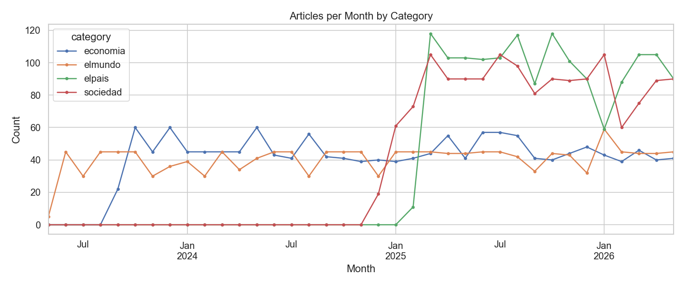
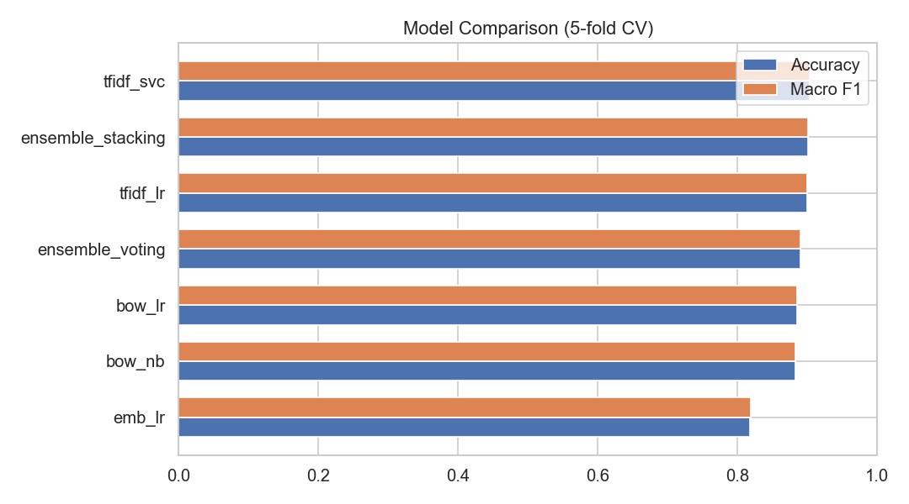
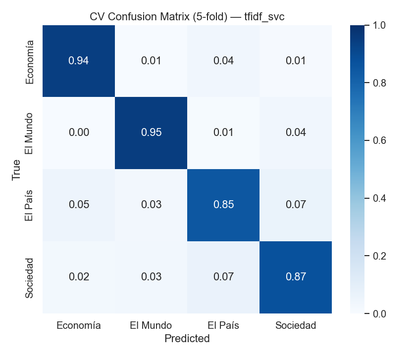
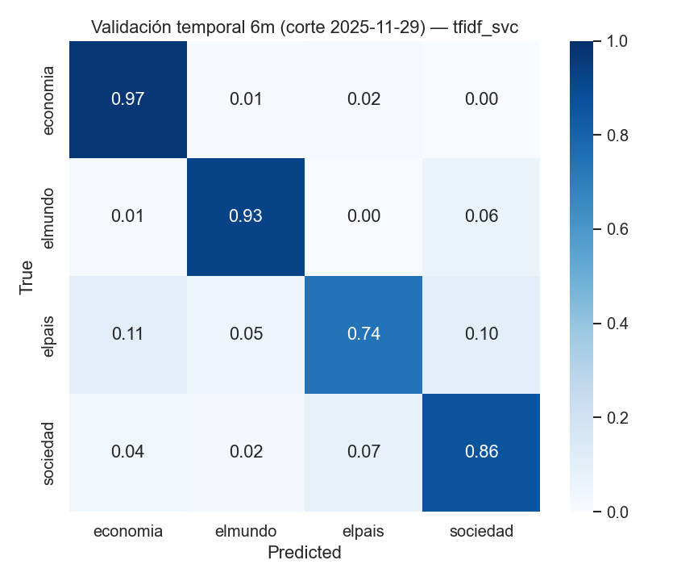

# Web Mining TP1 — Clasificación de Noticias de Página 12

Trabajo Práctico 1 de Web Mining. Pipeline completo y reproducible de *crawling*,
procesamiento NLP y clasificación automática de noticias del diario
[Página 12](https://www.pagina12.com.ar) en cuatro secciones: **Economía**,
**El País**, **Sociedad** y **El Mundo**.

> 📄 **Informe completo (decisiones, metodología y evaluación):**
> [`informe/informe_tp1.pdf`](informe/informe_tp1.pdf) — generado desde
> [`informe/informe_tp1.tex`](informe/informe_tp1.tex).

---

## Resultados

### Validación cruzada 5-fold estratificada (5.999 artículos)

| Modelo | Accuracy | Macro F1 |
|--------|:--------:|:--------:|
| **TF-IDF + LinearSVC** | **0.904 ± 0.011** | **0.903 ± 0.011** |
| Ensamble (stacking, meta-LR) | 0.901 ± 0.009 | 0.901 ± 0.009 |
| TF-IDF + Regresión Logística | 0.900 ± 0.010 | 0.900 ± 0.010 |
| Ensamble (soft voting) | 0.890 ± 0.009 | 0.890 ± 0.009 |
| BoW + Regresión Logística | 0.885 ± 0.007 | 0.885 ± 0.007 |
| BoW + Naive Bayes (baseline) | 0.883 ± 0.006 | 0.882 ± 0.006 |
| Sentence Embeddings + LR (alternativa moderna) | 0.818 ± 0.005 | 0.818 ± 0.005 |

### Validación temporal — 3 cortes (mejor modelo: TF-IDF + LinearSVC)

Entrena con las noticias anteriores a la fecha de corte y testea con las
posteriores. La consigna pide *"idealmente, más de un corte temporal"*:

| Corte | Fecha corte | Train | Test | Accuracy | Macro F1 |
|------:|-------------|------:|-----:|:--------:|:--------:|
| 3m | 2026-02-28 | 5.185 | 814 | 0.853 | 0.858 |
| 6m | 2025-11-29 | 4.403 | 1.596 | 0.848 | 0.853 |
| 9m | 2025-08-29 | 3.570 | 2.429 | 0.846 | 0.849 |
| **Promedio** | | | | **0.849 ± 0.003** | **0.853 ± 0.004** |

La caída CV → temporal es **moderada (~5 pts) pero muy estable** entre los tres
cortes, incluso al crecer el test de 814 a 2.429 noticias: el modelo generaliza a
noticias futuras y el resultado no es un accidente de un período puntual.

---

## Dataset

- **Fuente**: Página 12 vía API JSON de Arc Publishing
- **Artículos**: 5.999 (≈ 1.500 por sección, balanceado)
- **Rango temporal**: mayo 2023 → mayo 2026
- **Mediana de tokens por artículo**: 389

| Sección | Artículos |
|---------|----------:|
| Economía | 1.500 |
| El País | 1.500 |
| Sociedad | 1.500 |
| El Mundo | 1.499 |

Una **muestra de HTML crudo** (12 ejemplos por sección, bien etiquetados) se entrega
en [`muestra_html/`](muestra_html/) como pide la consigna.

---

## Estructura del proyecto

```
web_mining/
├── informe/
│   ├── informe_tp1.tex   # documento con todas las decisiones (LaTeX)
│   ├── informe_tp1.pdf   # ← informe compilado
│   ├── tabla_cv.tex      # tablas autogeneradas desde las métricas
│   └── tabla_temporal.tex
│
├── muestra_html/         # entregable: 12 HTML reales por sección
│   ├── economia/  elpais/  sociedad/  elmundo/
│
├── data/
│   ├── interim/          # articles.parquet (texto crudo estructurado)
│   └── processed/        # dataset.parquet  (texto preprocesado)
│
├── models/               # modelos entrenados (.joblib)
│
├── reports/
│   ├── figures/          # gráficos + matrices de confusión (CV y temporal)
│   ├── metrics/          # cv_results.json, temporal_validation.json
│   └── report.md         # reporte Markdown autogenerado
│
├── src/
│   ├── config/config.py              # configuración centralizada
│   ├── scraping/arc_api_scraper.py   # scraper vía Arc Publishing API
│   ├── parsing/html_parser.py        # parser HTML → DataFrame (fallback)
│   ├── preprocessing/text_cleaner.py # pipeline NLP español
│   ├── features/
│   │   ├── tfidf_features.py         # TF-IDF + BoW pipelines
│   │   └── embedding_features.py     # sentence-transformers
│   ├── training/trainer.py           # entrenamiento + CV + ensembles
│   ├── evaluation/evaluator.py       # métricas, validación temporal multi-corte, plots
│   └── utils/logging_utils.py
│
├── scripts/
│   ├── run_scraper.py          # crawling (Arc API)
│   ├── parse_html.py           # preprocesamiento NLP
│   ├── train.py                # entrenamiento + evaluación
│   ├── generate_report.py      # reporte Markdown
│   ├── make_latex_tables.py    # tablas LaTeX desde métricas
│   └── download_sample_html.py # muestra de HTML por sección
│
├── text_mining_python/   # código original de la cátedra (referencia)
└── requirements.txt
```

---

## Instalación

```bash
git clone git@github.com:vic-ruiz/web_mining.git
cd web_mining

pip install -r requirements.txt

# macOS (Apple Silicon): LightGBM necesita libomp
/opt/homebrew/bin/brew install libomp
```

---

## Ejecución end-to-end

```bash
# 1. Scraping (~15 min, ~6.000 artículos)
python3 scripts/run_scraper.py --articles-per-class 1500 --delay 1.0

# 2. Preprocesamiento NLP
python3 scripts/parse_html.py

# 3. Entrenamiento + evaluación (CV + validación temporal multi-corte)
python3 scripts/train.py

# 4. Reporte Markdown + tablas LaTeX
python3 scripts/generate_report.py
python3 scripts/make_latex_tables.py

# 5. Muestra de HTML por sección (entregable)
python3 scripts/download_sample_html.py --per-class 12

# 6. Compilar el informe
cd informe && pdflatex informe_tp1.tex && pdflatex informe_tp1.tex
```

---

## Decisiones de diseño (resumen)

El detalle completo está en el [informe](informe/informe_tp1.pdf). En síntesis:

### Por qué la API de Arc Publishing en vez del crawler de HTML

Página 12 usa el CMS Arc Publishing y resuelve la paginación de secciones con
JavaScript: el parámetro `?page=N` de las URLs es **ignorado por el servidor** (todas
las páginas devuelven el mismo bloque de ~23 notas). El sitio expone una API JSON
interna con paginación real:

```
GET /pf/api/v3/content/fetch/p12-section
    ?query={"page":N,"size":15,"primarySection":"/economia",...}
```

Devuelve el cuerpo completo y estructurado de cada nota (~666 páginas por sección).
La consigna habilita "cualquier herramienta, recurso y técnica", así que esta opción
respeta el espíritu del TP y mejora la calidad del dato. Para evitar **sesgo
temporal**, el crawler distribuye las páginas a lo largo de toda la historia de cada
sección (no solo las recientes).

### Por qué TF-IDF supera a los sentence-transformers

La tarea es de **dominio léxico**: las secciones se distinguen por vocabulario
específico (Economía: "dólar", "inflación", "BCRA"; El Mundo: "ONU", "Gaza",
"Ucrania"). TF-IDF captura esas señales; los embeddings de MiniLM las comprimen en un
espacio semántico continuo y además truncan a 128 tokens artículos de mediana 389
tokens. Por eso el baseline clásico, bien ajustado, gana a la alternativa moderna en
esta tarea concreta — un hallazgo en sí mismo.

### Clases difíciles (análisis de la matriz de confusión)

- **El País** es la sección más difícil (recall ≈85% en CV, 74% en el corte temporal
  de 6 meses): su contenido político-nacional se solapa con Sociedad y Economía.
- El par **El País ↔ Sociedad** es el más confundido (~7% en ambos sentidos, casi
  simétrico).
- La confusión **El País → Economía** (~5.4%) supera a la inversa (~3.6%): las notas
  de política económica tienden a etiquetarse como Economía.
- **El Mundo** y **Economía** son las mejor separadas (recall ≈95% y ≈94%).

### Por qué el ensamble no mejora al mejor modelo

El stacking reduce la varianza entre folds pero no la media: los modelos base cometen
**errores correlacionados** (todos confunden los mismos pares), así que el
meta-learner no encuentra señal complementaria.

---

## Stack tecnológico

| Componente | Tecnología |
|---|---|
| Scraping | `requests` + Arc Publishing API |
| Procesamiento de datos | `pandas`, `pyarrow` |
| NLP / Stemming | `nltk` (Snowball español) |
| Features clásicas | `scikit-learn` (TF-IDF, CountVectorizer) |
| Features modernas | `sentence-transformers` (MiniLM-L12-v2) |
| Clasificadores | `scikit-learn` (LR, LinearSVC, Voting, Stacking) |
| Visualización | `matplotlib`, `seaborn` |
| Persistencia | `joblib` |
| Informe | LaTeX |

---

## Figuras

### Artículos por mes y sección


### Comparación de modelos (CV)


### Matriz de confusión — CV 5-fold (mejor modelo)


### Matriz de confusión — validación temporal (corte 6m)

